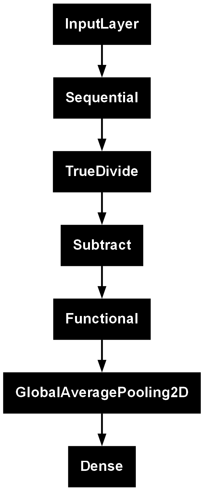
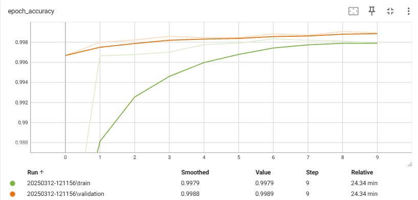
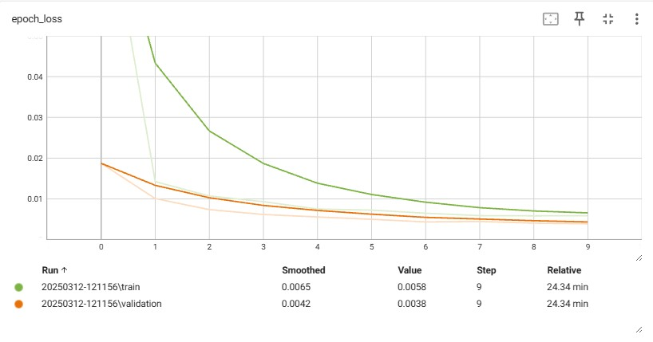

# Concrete Crack Classification

## Project Overview

This project focuses on developing an AI-based image classification model to identify concrete cracks. Concrete cracks, if left untreated, can compromise the safety and durability of buildings, potentially endangering lives. Early detection through AI-based classification can prevent structural failures and improve maintenance efficiency.

---

## Dataset

The dataset contains concrete images with and without cracks. The data is collected from various METU Campus Buildings. It is divided into two classes: negative (no crack) and positive (crack) images for classification.

* [Data Source Of Dataset](https://data.mendeley.com/datasets/5y9wdsg2zt/2)

* Each class contains 20,000 images, totaling 40,000 images.

* Image size: 227 × 227 pixels with RGB channels.

* Derived from 458 high-resolution images (4032 × 3024 pixels) using the method proposed by Zhang et al. (2016).

---

## Objective

This project aims to classify concrete crack images using a deep learning model with transfer learning. The dataset is loaded, preprocessed, and augmented before being used to train a model based on MobileNetV2.

---

## Project Structure

*Data Loading*: Load images from the dataset directory.

*Data Inspection*: Visualize sample images and class labels.

*Data Splitting*: Split the dataset into training, validation, and test sets.

*Data Augmentation*: Apply transformations such as flipping and rotation.

*Model Creation*: Build a classification model using MobileNetV2 as a feature extractor.

*Model Compilation*: Configure the optimizer, loss function, and evaluation metrics.

*Training*: Train the model using TensorBoard logging and early stopping.

---

## Model Architecture

*Base Model*: MobileNetV2 (pretrained on ImageNet, frozen during training)

*Augmentation*: Random flipping and rotation

*Classifier*: GlobalAveragePooling2D + Dense layer with softmax activation

---

### Training Details

*Optimizer*: Adam (learning rate = 0.0001)

*Loss Function*: Sparse Categorical Crossentropy

*Batch Size*: 32

*Image Size*: 160x160

*Epochs*: 10

*Callbacks*: TensorBoard logging, EarlyStopping (patience=3)

---

## Result

Training history and model performance metrics are logged using TensorBoard.

*Accurancy*

*Loss*

---

## Contribute

Special thanks to the developers of TensorFlow, Keras, and NLTK for their contributions.

---

# License

This project is open-source and available for modification and distribution.